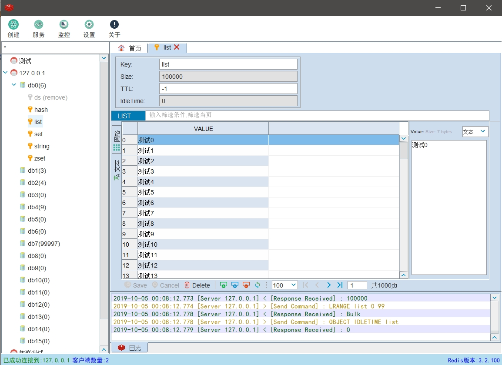
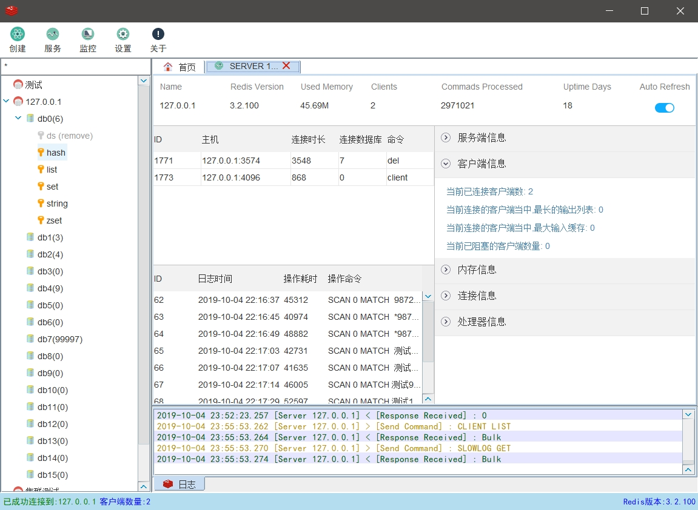
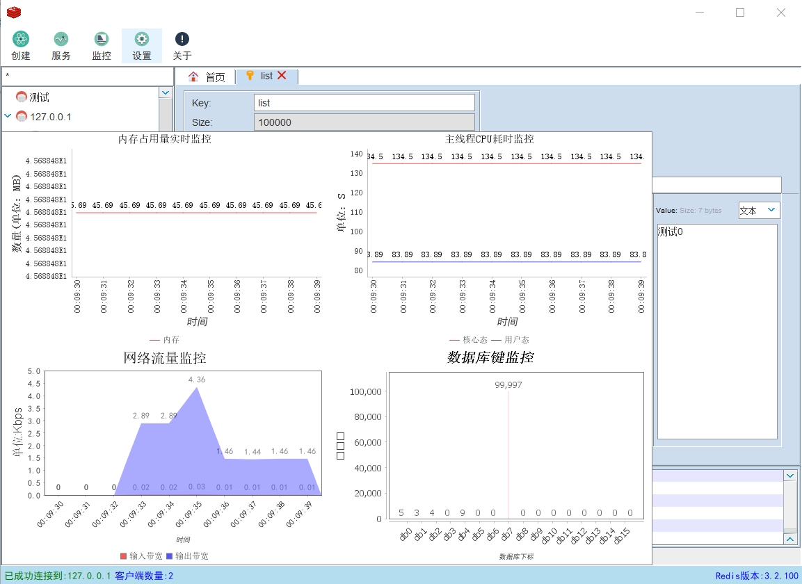

# RedisLark

#### 项目介绍

RedisLark是一款基于java swing的跨平台的Redis桌面管理工具，该软件支持单机、集群模式连接，RedisPlus遵循GPL-3.0开源协议，禁止二次开发打包发布盈利，违反必究！。










 

#### 版本说明

版本的命名规则以x.y.z形式，如1.0.0

x位主版本号是在重大版本更新发布会更改 ，例如v1.1.0更改为v2.0.0 版本会增加支持ssh通道连接等功能

y位版本号一般是解决了多个缺陷后，发布的一个小版本，例如v1.1.0解决了1.0.0 的问题后发布的小版本

z位的更改不会发布版本，这是缺陷修复或者小需求增加的正常迭代

####  技术选型

1.支持跨平台，使用java开发

2.使用javaswing的桌面元素

3.使用lettuce做redis连接工具

4.采用jfreechart做图表统计

####  打包方法

环境要求：Java8+ 

克隆项目源码，进入源码地址，执行以下命令：

```
mvn clean install 	-Dmaven.test.skip=true -P prod 
```

执行命令

```java
java -jar redisLark-x.y.z.jar
```

x.y.z为版本号

####  后续支持

目前要做的事情是完善国际化， 支持订阅和发布功能，也在考虑之中。

